# Farol

[](https://github.com/luigrocha/farol/actions/workflows/test.yml)

**Predictive personal finance for Brazilian CLT workers.** Offline-first, realtime-collaborative, with a deterministic forecasting engine that understands Swile, FGTS, 13th salary, and your cutoff day.

---

## Table of Contents

- [Features](#features)
- [Screens](#screens)
- [Architecture Overview](#architecture-overview)
- [Class Diagrams](#class-diagrams)
  - [Domain Entities](#domain-entities)
  - [Domain Services](#domain-services)
  - [Value Objects](#value-objects)
  - [Repository Layer](#repository-layer)
  - [Sync Infrastructure](#sync-infrastructure)
  - [Workspace & Collaboration](#workspace--collaboration)
- [Database Schema](#database-schema)
  - [Supabase (Remote)](#supabase-remote)
  - [Drift (Local SQLite)](#drift-local-sqlite)
- [Sequence Diagrams](#sequence-diagrams)
  - [App Startup](#app-startup)
  - [Add Expense (Offline-first)](#add-expense-offline-first)
  - [Create Installment Purchase](#create-installment-purchase)
  - [Financial Snapshot Computation](#financial-snapshot-computation)
  - [Workspace Invite & Accept](#workspace-invite--accept)
  - [Realtime Activity Feed](#realtime-activity-feed)
- [Stack](#stack)
- [Business Logic](#business-logic)
- [Setup](#setup)
- [Testing & Quality](#testing--quality)
- [License](#license)

---

## Features

- **Predictive Engine** — Burn rate, days until empty, projected closing balance, and cashflow forecast
- **CLT-native** — Customizable `cutoffDay`, Swile as a separate bucket, FGTS auto-projection, 13th salary simulator with INSS + IRRF 2025 progressive tables
- **Offline-first + Sync** — Drift SQLite local-first, optimistic updates, persistent operation queue, idempotent retry
- **Multi-user Workspaces** — Shared spending with role-based access, attribution, activity feed, and realtime presence
- **Budget with Envelopes** — Per-category targets with 4-level alerts, rollover between periods
- **Recurring Rules** — RRULE-based engine, auto-generates occurrences 3 months ahead, detects patterns in history
- **Intelligence Layer** — 12 deterministic insight rules (no ML), dismiss tracking and stats
- **Installment Plans** — Full lifecycle: create, track payments, integrate with cashflow forecast
- **31 test files, 0 lint warnings** — Unit, widget, sync, and integration tests enforced by CI

---

## Screens

| Screen | What it does |
|---|---|
| **Dashboard** | Net worth KPIs, health score (0–10), burn rate, contribution bar (shared workspaces), expense breakdown, activity feed preview |
| **Transactions** | Full expense/income/installment history with filters, date range, search. Member attribution in shared workspaces |
| **Analytics** | Cashflow forecast chart (actual + projected), revenue/expense trends, category distribution, monthly comparison |
| **Budget** | Period envelopes with progress bars, rollover badge, last-edit attribution, 4-level alerts |
| **Recurring** | Recurring rules with occurrence calendar, auto-detection suggestions |
| **Installments** | Active installment plans with payment schedule and cashflow impact |
| **Activity** | Day-grouped feed with infinite scroll, pull-to-refresh, realtime updates |
| **Workspace** | Switcher, create/invite members, manage roles, transfer ownership |
| **Settings** | Profile, salary config (gross/net/Swile), budget goals, 13th simulator, export, theme |
| **Investments** | Portfolio positions (Treasury, CDB, REIT), allocation insights |

---

## Architecture Overview

```
┌─────────────────────────────────────────────────────────────────────┐
│                        PRESENTATION LAYER                           │
│          Flutter Screens + Widgets  ←→  Riverpod Providers          │
└────────────────────────────┬────────────────────────────────────────┘
                             │ reads / watches
┌────────────────────────────▼────────────────────────────────────────┐
│                         DOMAIN LAYER                                │
│   FinancialEngine · ForecastingEngine · EnvelopeEngine              │
│   IntelligenceLayer · InstallmentService · RecurringService         │
│   ObligationEngine · RecurrenceResolver · RecurringDetector         │
│                  (pure Dart — no I/O)                               │
└──────────────┬───────────────────────────┬──────────────────────────┘
               │ calls                     │ reads
┌──────────────▼──────────┐   ┌────────────▼──────────────────────────┐
│     REPOSITORIES        │   │           INFRASTRUCTURE              │
│  21 repos (Supabase     │   │  SyncManager · OperationQueue         │
│  + workspace_id filter) │   │  ConflictResolver · Drift DAOs        │
└──────────────┬──────────┘   └────────────┬──────────────────────────┘
               │                           │
┌──────────────▼──────────┐   ┌────────────▼──────────────────────────┐
│     SUPABASE REMOTE     │   │      DRIFT LOCAL (SQLite)             │
│  36 migrations · RLS    │   │  8 tables · OperationQueue            │
│  Edge Functions         │   │  UserSettings · CategoryCache         │
│  Realtime channels      │   │  ForecastCache                        │
└─────────────────────────┘   └───────────────────────────────────────┘
```

```
lib/
├── core/
│   ├── domain/              # Pure Dart — entities, services, value objects
│   │   ├── entities/        FinancialSnapshot, Envelope, BurnRate, LiquidityRisk,
│   │   │                    InstallmentPlan/Payment, RecurringRule/Occurrence,
│   │   │                    FinancialInsight, FinancialProjection, WorkspaceActivity
│   │   ├── services/        FinancialEngine, ForecastingEngine, EnvelopeEngine,
│   │   │                    ObligationEngine, IntelligenceLayer, InstallmentService,
│   │   │                    RecurringService, RecurrenceResolver, RecurringDetector
│   │   └── value_objects/   Money (cents-based), CategoryRef, MemberDisplay
│   ├── repositories/        21 repositories — Supabase + workspace scoping
│   ├── providers/           providers.dart — 40+ Riverpod autoDispose providers
│   │                        workspace_providers.dart — 13 workspace/collab providers
│   ├── database/            Drift schema (SQLite), DAOs, migrations
│   ├── infrastructure/sync/ SyncManager, OperationQueue, ConflictResolver
│   ├── models/              Expense, Income, Account, Category, Workspace, etc.
│   ├── services/            WorkspaceRealtimeService, ExportService
│   └── widgets/             FeatureGate, MemberChip, WorkspaceAppBarChip, ActivityFeedTile
├── features/
│   ├── dashboard/           KPIs, health gauge, burn rate, contribution bar, insights
│   ├── transactions/        List, filters, quick-add, edit/delete
│   ├── analytics/           Cashflow chart, trends, distribution, velocity
│   ├── budget/              Period envelopes, budget edit sheet, progress bars
│   ├── recurring/           Rules list, occurrence calendar, suggestions
│   ├── installments/        Plans list, payment schedule
│   ├── activity/            Activity feed screen, infinite scroll
│   ├── workspace/           Switcher, create, invite, members management
│   ├── auth/                Login, signup, session management
│   └── settings/            Profile, salary, goals, 13th simulator, export
└── main.dart                Entry point, MainShell with responsive NavigationRail
```

---

## Class Diagrams

### Domain Entities

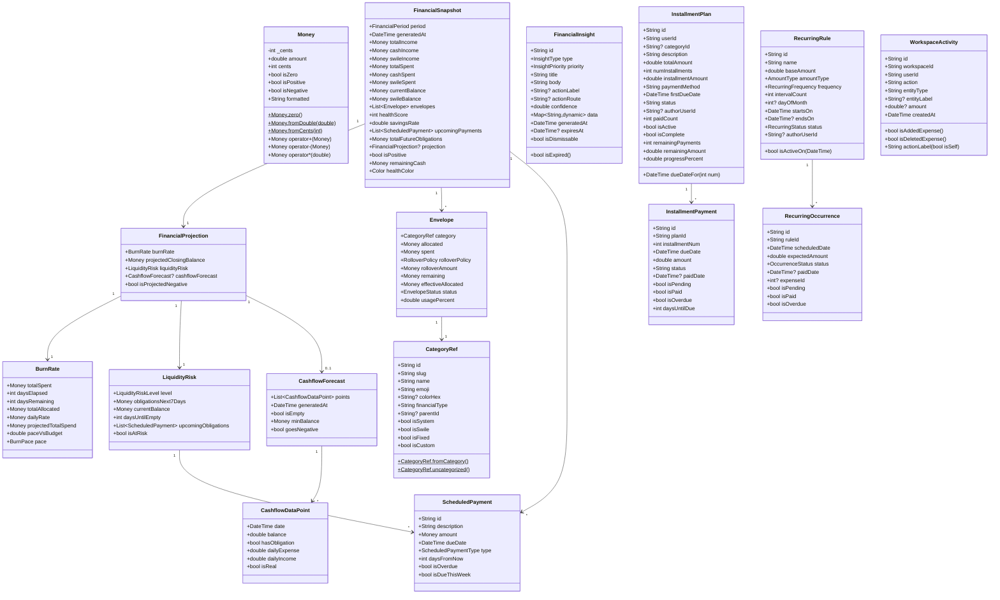

### Domain Services

```mermaid
classDiagram
    class FinancialEngine {
        +FinancialSnapshot buildSnapshot(period, incomes, expenses, netSalaryOverride, swileOverride, emergencyFund, activePlans, envelopes, totalAllocated)
    }

    class ForecastingEngine {
        +FinancialProjection buildProjection(period, totalSpent, totalAllocated, currentBalance, projectedIncome, obligations, expenseHistory, buildForecastChart)
    }

    class EnvelopeEngine {
        +List~Envelope~ buildEnvelopes(entries, categoriesBySlug, previousExpenses, previousPeriod)
        +Money totalAllocated(envelopes)
        +Money totalSpent(envelopes)
    }

    class ObligationEngine {
        +List~ScheduledPayment~ buildObligations(pendingInstallments, pendingOccurrences)
        +int daysUntilEmpty(balance, dailyRate, obligations)
    }

    class IntelligenceLayer {
        +int maxVisible$
        +double minConfidence$
        +List~FinancialInsight~ analyze(snapshot, projection, recentExpenses, allExpenses, dismissedIds, consecutiveUnderBudgetPeriods, previousInstallmentTotal)
    }

    class InstallmentService {
        -InstallmentPlanRepository _planRepo
        -InstallmentPaymentRepository _paymentRepo
        -ExpenseRepository _expenseRepo
        +Future~InstallmentPlan~ createPurchase(description, purchaseDate, totalAmount, numInstallments, paymentMethod, firstDueDate, categorySlug, cutoffDay)
        +Future~InstallmentPayment~ payInstallment(payment, paidDate, paidAmount, expenseId)
        +Future~InstallmentPayment~ skipInstallment(payment)
    }

    class RecurringService {
        -RecurringRulesRepository _rulesRepo
        -RecurringOccurrencesRepository _occurrencesRepo
        -ExpenseRepository _expenseRepo
        -RecurrenceResolver _resolver
        +Future~RecurringRule~ createRule(rule)
        +Future~RecurringRule~ updateRule(id, rule)
        +Future~void~ pauseRule(id, until)
        +Future~void~ cancelRule(id)
        +Future~void~ deleteRule(id)
        +Future~RecurringOccurrence~ payOccurrence(occurrence, paidDate, actualAmount, expenseId)
        +Future~RecurringOccurrence~ skipOccurrence(occurrence, notes)
        +Future~int~ generateUpcomingOccurrences(monthsAhead)
    }

    class RecurrenceResolver {
        +List~RecurringOccurrence~ generateOccurrences(rule, rangeStart, rangeEnd)
    }

    class RecurringDetector {
        +List~RecurringRuleCandidate~ detect(history, existingRuleNames)
    }

    class CategoryResolver {
        +void updateCache(List~CategoryRef~)
        +CategoryRef resolve(String rawValue)
        +bool isLoaded
    }

    InstallmentService --> InstallmentPlanRepository
    InstallmentService --> InstallmentPaymentRepository
    InstallmentService --> ExpenseRepository
    RecurringService --> RecurringRulesRepository
    RecurringService --> RecurringOccurrencesRepository
    RecurringService --> ExpenseRepository
    RecurringService --> RecurrenceResolver
    FinancialEngine --> FinancialSnapshot
    ForecastingEngine --> FinancialProjection
    ForecastingEngine --> BurnRate
    ForecastingEngine --> LiquidityRisk
    ForecastingEngine --> ObligationEngine
    EnvelopeEngine --> Envelope
    IntelligenceLayer --> FinancialInsight
```

### Value Objects

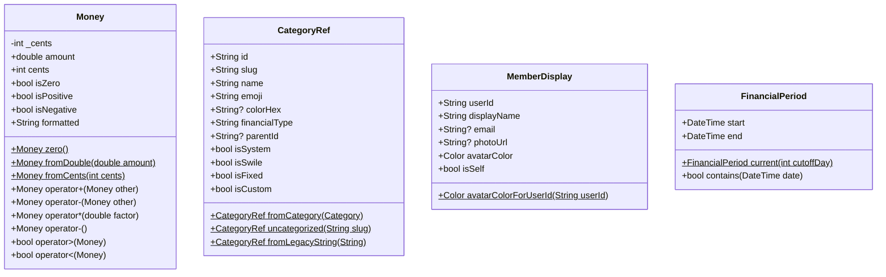

### Repository Layer

```mermaid
classDiagram
    class ExpenseRepository {
        -SupabaseClient _supabase
        -String? workspaceId
        +Stream~List~Expense~~ watchPeriod(period)
        +Future~Expense~ insert(transactionDate, category, amount, paymentMethod, ...)
        +Future~void~ update(id, fields)
        +Future~void~ delete(id)
        +Future~List~Expense~~ fetchRange(start, end)
    }

    class InstallmentPlanRepository {
        -SupabaseClient _supabase
        -String? workspaceId
        +Future~List~InstallmentPlan~~ getActive()
        +Future~InstallmentPlan~ create(plan)
        +Future~void~ updateStatus(id, status)
        +Future~void~ delete(id)
    }

    class InstallmentPaymentRepository {
        -SupabaseClient _supabase
        +Future~List~InstallmentPayment~~ getByPlan(planId)
        +Future~List~InstallmentPayment~~ insertAll(payments)
        +Future~InstallmentPayment~ markPaid(id, paidDate, paidAmount)
        +Future~InstallmentPayment~ markSkipped(id)
    }

    class RecurringRulesRepository {
        -SupabaseClient _supabase
        -String? workspaceId
        +Future~List~RecurringRule~~ getActive()
        +Future~RecurringRule~ create(rule)
        +Future~RecurringRule~ update(id, rule)
        +Future~void~ updateStatus(id, status)
        +Future~void~ delete(id)
    }

    class RecurringOccurrencesRepository {
        -SupabaseClient _supabase
        +Future~List~RecurringOccurrence~~ getPending(before)
        +Future~void~ upsertOccurrences(occurrences)
        +Future~RecurringOccurrence~ markPaid(id, paidDate, actualAmount)
        +Future~RecurringOccurrence~ markSkipped(id, notes)
    }

    class WorkspaceRepository {
        -SupabaseClient _supabase
        +Future~List~Workspace~~ getUserWorkspaces()
        +Future~Workspace~ create(name, type, emoji, color)
        +Future~Workspace~ update(id, fields)
        +Future~void~ updateIdentity(id, emoji, color, name)
        +Future~void~ inviteMember(workspaceId, email, role)
        +Future~void~ removeMember(workspaceId, userId)
        +Future~void~ delete(id)
    }

    class WorkspaceActivityRepository {
        -SupabaseClient _supabase
        -String? workspaceId
        +Future~List~WorkspaceActivity~~ fetchLatest(limit)
        +Future~List~WorkspaceActivity~~ fetchPage(cursor, limit)
    }

    class CategoryRepository {
        -SupabaseClient _supabase
        -String? workspaceId
        +Stream~List~Category~~ watchAll()
        +Future~List~Category~~ getAll()
        +Future~Category~ insert(category)
        +Future~void~ update(id, fields)
        +Future~void~ delete(id)
        +Future~void~ bulkInsert(categories)
    }

    class ForecastCacheRepository {
        -AppDatabase _db
        +Future~CashflowForecast?~ get(periodKey)
        +Future~void~ put(periodKey, forecast)
        +Future~void~ invalidate(periodKey)
    }

    class DismissedInsightsRepository {
        -AppDatabase _db
        +Future~Set~String~~ getDismissed()
        +Future~void~ dismiss(id, type)
        +Future~void~ undismiss(id)
        +Future~List~InsightStats~~ getStats()
    }

    ExpenseRepository --> Expense
    InstallmentPlanRepository --> InstallmentPlan
    InstallmentPaymentRepository --> InstallmentPayment
    RecurringRulesRepository --> RecurringRule
    RecurringOccurrencesRepository --> RecurringOccurrence
    WorkspaceActivityRepository --> WorkspaceActivity
```

### Sync Infrastructure

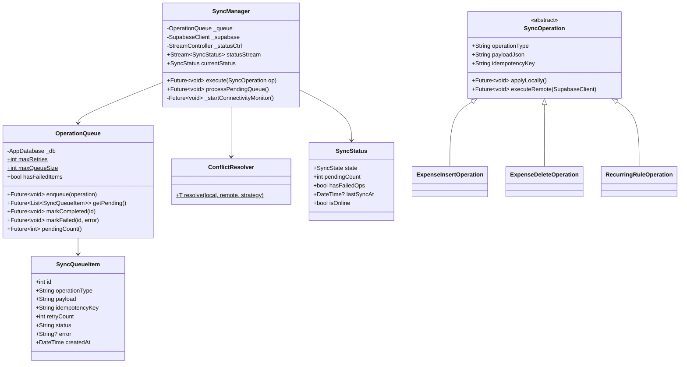

### Workspace & Collaboration

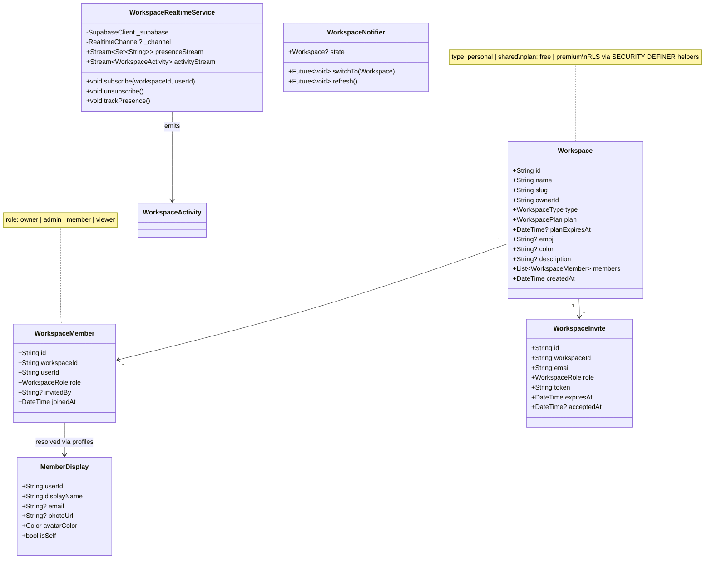

---

## Database Schema

### Supabase (Remote)

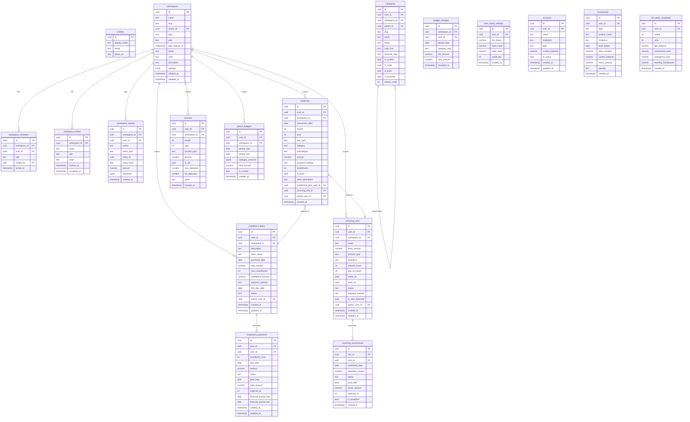

### Drift (Local SQLite)

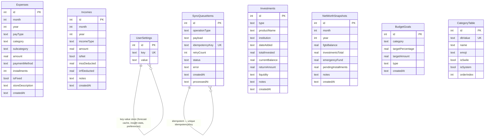

---

## Sequence Diagrams

### App Startup

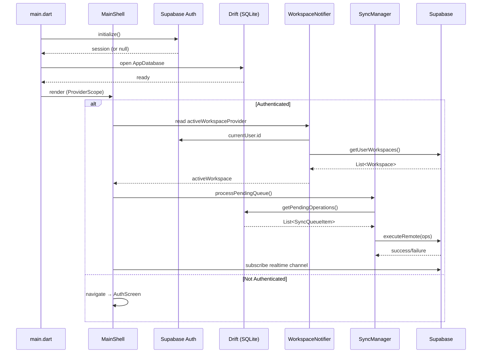

### Add Expense (Offline-first)

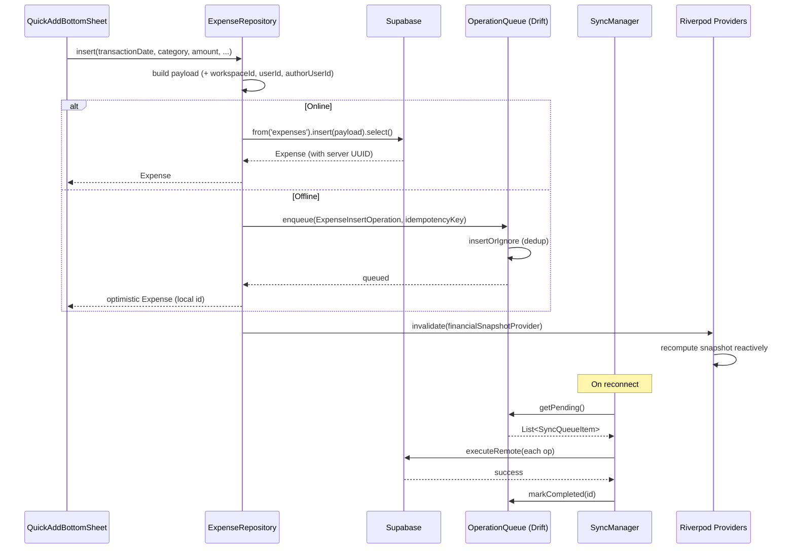

### Create Installment Purchase

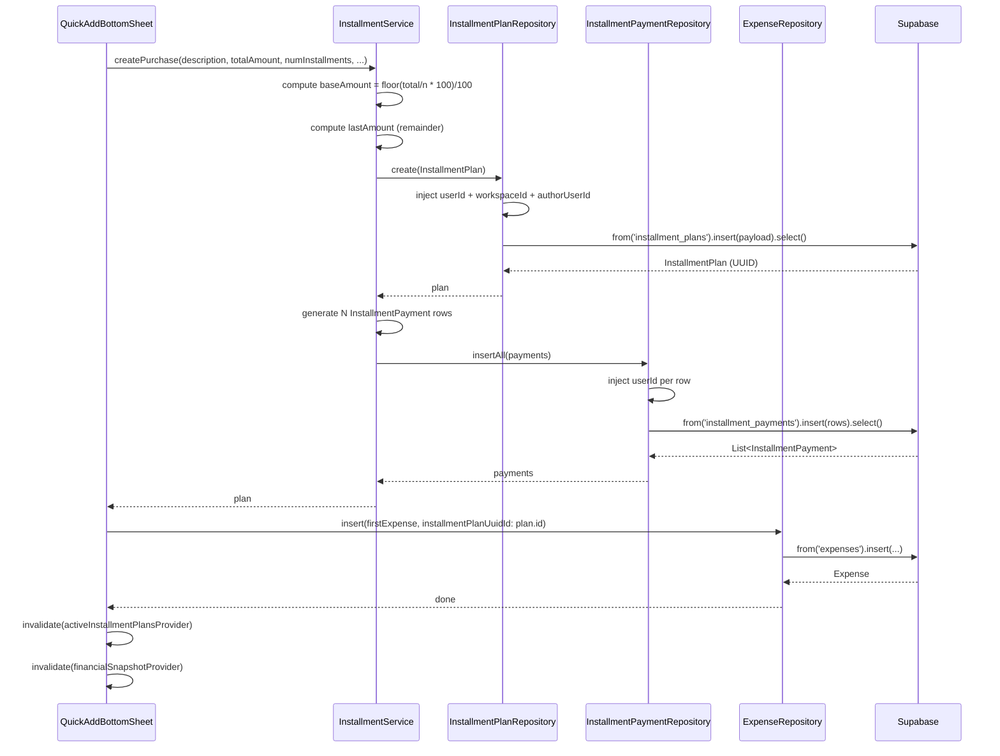

### Financial Snapshot Computation

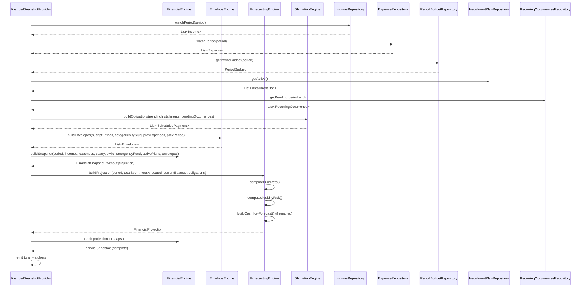

### Workspace Invite & Accept

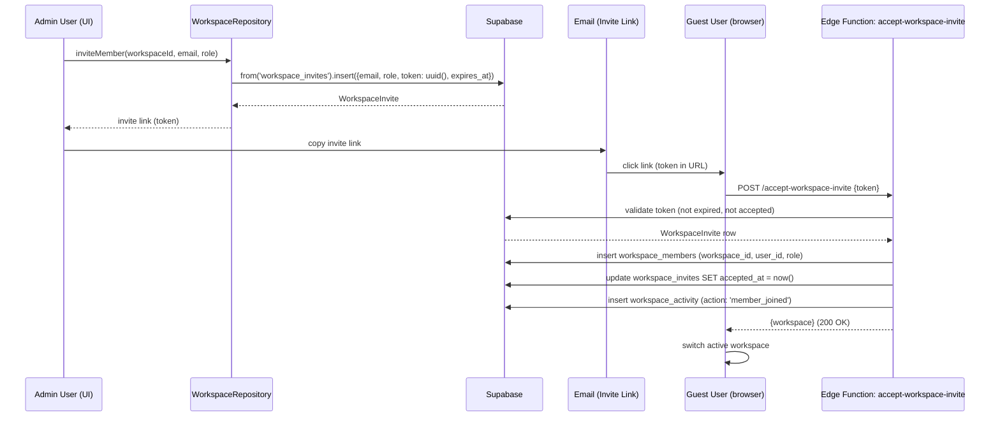

### Realtime Activity Feed

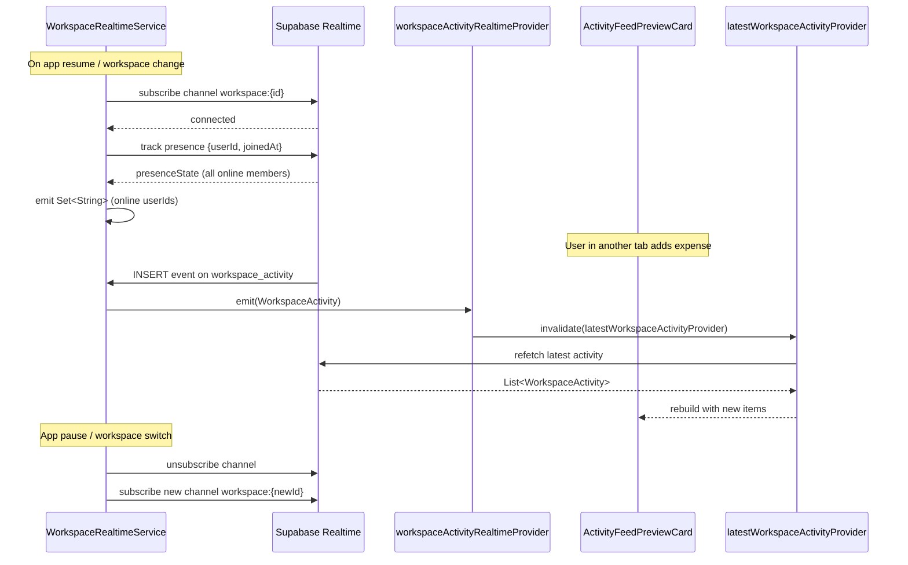

---

## Stack

| Layer | Technology |
|---|---|
| **Language** | Dart 3 |
| **Framework** | Flutter 3 (Material 3) |
| **State** | Riverpod 2 (autoDispose) |
| **Local DB** | Drift (SQLite) — type-safe DAOs, auto migrations |
| **Backend** | Supabase — auth, REST, realtime, Edge Functions |
| **RLS** | SECURITY DEFINER helper functions (workspace isolation) |
| **Charts** | fl_chart — line, pie, bar (animated, responsive) |
| **Fonts** | Google Fonts (Manrope) |
| **Code Gen** | build_runner (Drift, Riverpod) |

---

## Business Logic

### Predictive Financial Engine

The engine is **deterministic**, not ML. Works from day one with zero history:

- **Burn Rate** — Average daily spending, projected forward to period end
- **Days Until Empty** — Cash balance ÷ burn rate with scheduled obligations subtracted
- **Projected Closing Balance** — Current balance + projected income − burn projection − installment drops
- **Cashflow Forecast** — 90-day chart (solid = actual, dashed = projected) with obligation event markers
- **Category Velocity** — Spending rate per category vs historical average (2σ spike detection)

### Intelligence Layer (12 rules)

No ML. Pure deterministic rules triggered on each snapshot recomputation:

| Rule | Trigger |
|---|---|
| `overdraftRisk` | Projected balance goes negative before period end |
| `liquidityAlert` | Days-until-empty < 7 with known obligations |
| `budgetOverrun` | Envelope spent > 100% of allocated |
| `spendingSpike` | Category spend > 2σ above monthly average |
| `subscriptionCreep` | Total recurring rules increased month-over-month |
| `duplicateCharge` | Same merchant, same amount within 3 days |
| `savingsOpportunity` | Savings rate < historical average by >10% |
| `earlyPayoff` | Installment plan can be paid off with current balance |
| `budgetStreak` | N consecutive periods under budget |
| `savingsRecord` | Highest savings rate in last 12 periods |
| `debtReduction` | Installment total reduced vs previous period |
| `categoryUnderControl` | High-spend category now tracking under budget |

### Budget Envelope Alerts

- 🟢 Green — < 75% spent
- 🟡 Yellow — 75–89% spent
- 🟠 Orange — 90–99% spent
- 🔴 Red — ≥ 100% spent (overspent)

### CLT-specific Features

- **FGTS**: Auto-projected at 8% of gross salary
- **13th Salary**: Full INSS + IRRF 2025 progressive table simulation with dependent deductions
- **Swile**: Separate Meal/Food buckets excluded from cash burn rate
- **Cutoff Day**: Customizable period start (default day 1, most Brazilians use 5–15)

### Workspace Roles

| Role | Create/Edit Transactions | Manage Members | Transfer Ownership |
|---|---|---|---|
| **Owner** | ✅ | ✅ | ✅ (via Edge Function) |
| **Admin** | ✅ | ✅ | ❌ |
| **Writer** | ✅ | ❌ | ❌ |
| **Viewer** | ❌ | ❌ | ❌ |

---

## Setup

### Prerequisites

- Flutter 3.27+ ([install](https://flutter.dev))
- Dart SDK ≥ 3.0 (included with Flutter)
- Git

### Install

```bash
git clone https://github.com/luigrocha/farol.git
cd farol
flutter pub get
dart run build_runner build --delete-conflicting-outputs
flutter run
```

### Web

```bash
flutter run -d chrome --dart-define-from-file=env.json
```

### Dev

```bash
flutter analyze          # 0 issues expected
flutter test             # 31 files, 182+ tests
```

---

## Testing & Quality

| Metric | Status |
|---|---|
| **Lint warnings** | 0 (`flutter analyze` clean) |
| **Test files** | 31 (unit + widget + sync + integration) |
| **Total tests** | 182+ |
| **CI** | GitHub Actions — Flutter 3.27, Ubuntu |
| **Coverage** | Forecasting engine, intelligence layer, sync (queue, conflict resolver, manager), financial engine, envelope engine, recurring engine, installment service, repositories, auth UI |

---

## License

© 2026 Luis Rocha. MIT.
